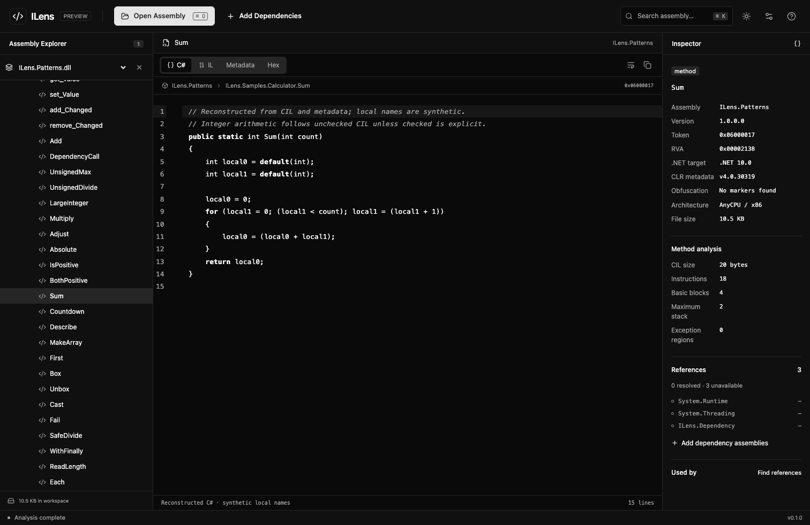
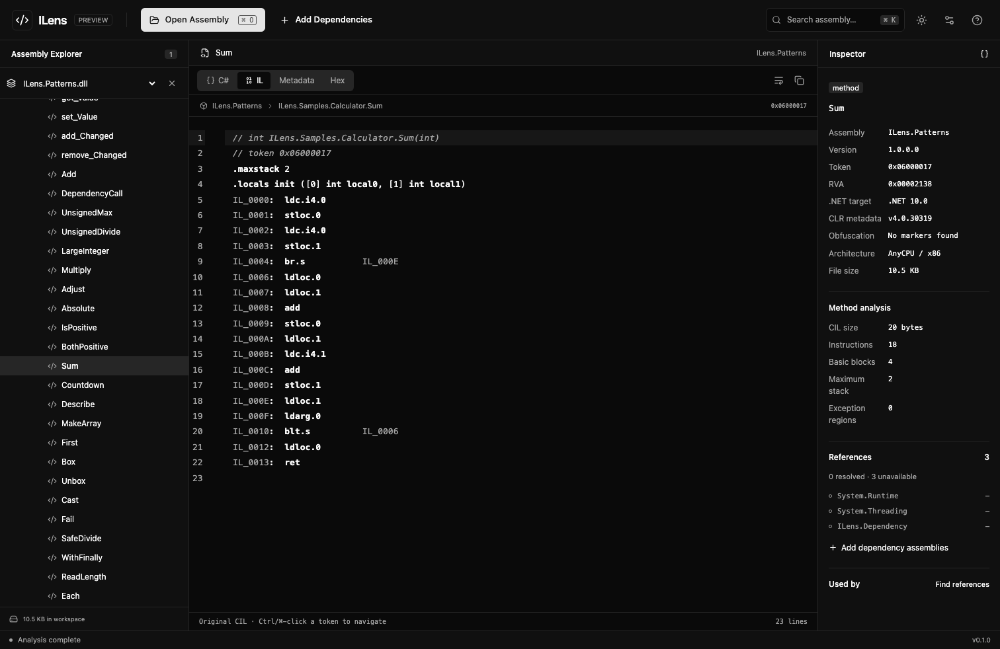
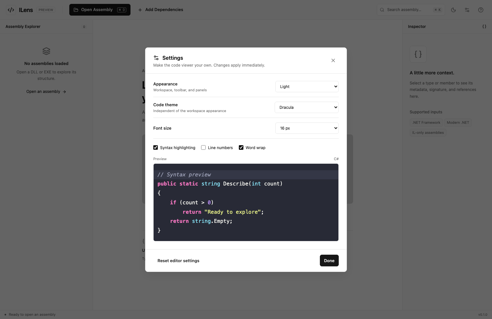
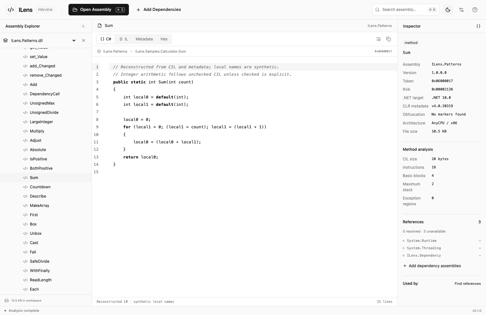
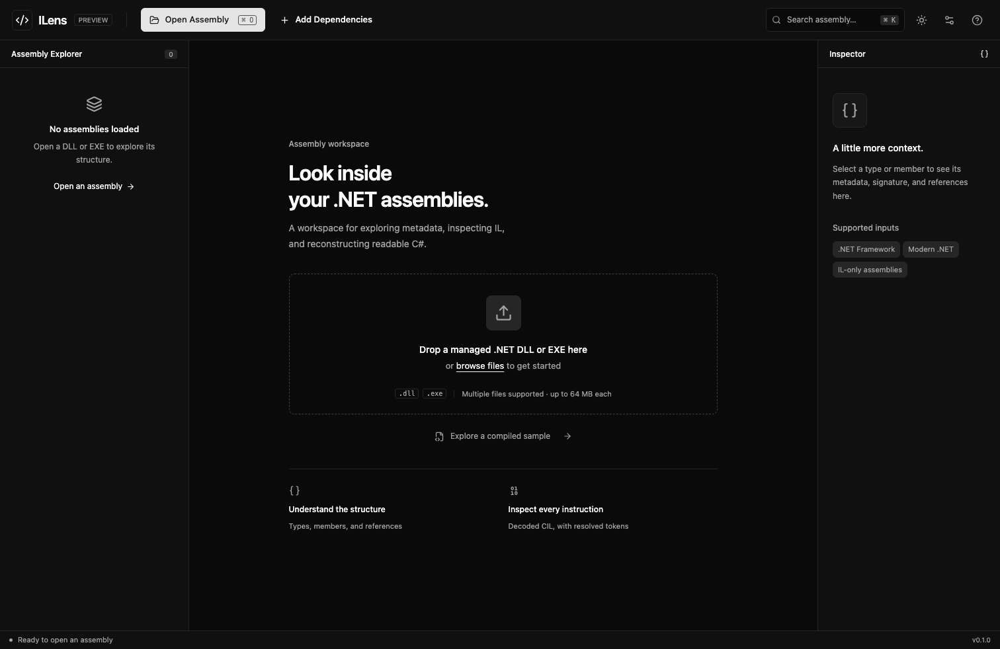
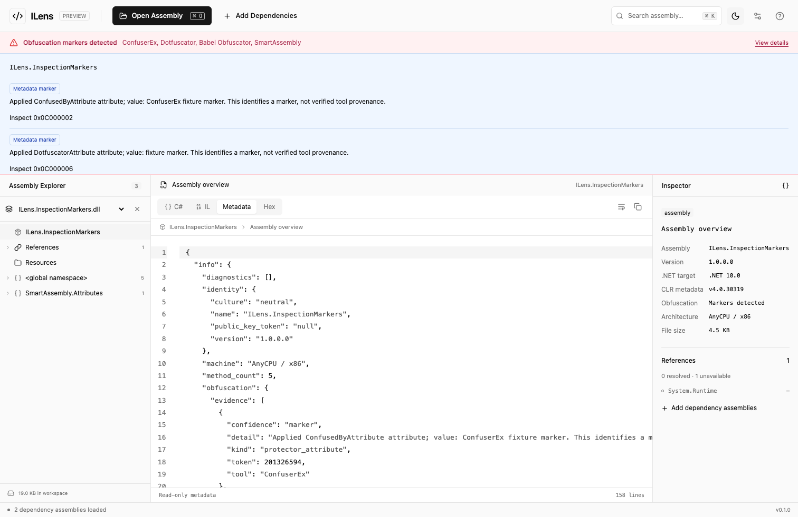

# ILens

A browser-based .NET assembly explorer and decompiler. Open a managed DLL or EXE, browse its types and members, inspect CIL, and reconstruct readable C# for supported methods.

ILens uses **Rari, React, and TypeScript** for the interface and a **Rust WebAssembly core** inside a browser worker for static analysis. Assembly contents stay in the browser and are never executed.

This is an early decompiler release. Reconstructed code is not the original source; unsupported patterns fall back to annotated IL.

## Features

- Assembly, namespace, type, and member explorer with virtualized rows and resizable panes.
- Independent C#, IL, metadata, and raw-byte views with resolved metadata tokens.
- Local search across declarations and strings, dependency loading, and reference navigation.
- Declared .NET target and CLR metadata versions displayed separately.
- Obfuscator marker inspection with evidence and clearly labeled naming heuristics.
- Dark and light appearance, six code themes, syntax highlighting controls, and saved editor preferences.
- Bounds-checked parsing, structured diagnostics, cancellation, and explicit workspace cleanup.

## Quick start

Install Node.js **22.23.1** and Rust through [rustup](https://rustup.rs/). The repository selects Rust **1.92.0**, its WASM target, and formatting/linting components automatically. The .NET SDK is only needed to regenerate the included test fixtures.

```sh
git clone https://github.com/yusufgenc34/ILens.git
cd ILens
npm ci
npm run dev
```

Open [localhost:5173](http://localhost:5173). If you use nvm, run `nvm install` and `nvm use` to select the version in `.nvmrc`.

The first build installs the matching `wasm-bindgen-cli` and compiles the WASM core. It needs network access and may take several minutes. Generated bindings are placed automatically in `src/wasm`.

1. Open a managed assembly or drag files onto the application.
2. Select a type or method in the Assembly Explorer.
3. Switch between C#, IL, Metadata, and Hex.
4. Add dependency assemblies when you want to resolve external definitions.
5. Open Settings to customize the code viewer.

Use `Ctrl/Cmd K` for metadata search, `Ctrl/Cmd F` inside the editor, and `Ctrl/Cmd`-click a metadata token to navigate. Refreshing clears the loaded assemblies; editor preferences are retained.

## Docker Compose

Docker Engine/Desktop with Compose v2 is sufficient; host Node.js and Rust installations are not required.

```sh
docker compose up --build -d
```

Open [localhost:3000](http://localhost:3000).

```sh
docker compose ps
docker compose logs -f app
docker compose down
```

To use a different host port:

```sh
ILENS_PORT=8080 docker compose up --build -d
```

Optional settings are documented in [.env.example](.env.example). The default binding is loopback. For access through another host or an HTTPS reverse proxy, configure `ILENS_BIND_ADDRESS` and `ILENS_PORT` for your environment.

The multi-stage image compiles Rust/WASM and the Rari application, then runs the production server as an unprivileged user. Compose includes a health check, a read-only application filesystem, and a temporary `/tmp`. It requires no database, volume, credentials, or assembly storage. Docker serves the application; assembly analysis still runs in the browser.

## GitHub Codespaces and Dev Containers

The included [.devcontainer configuration](.devcontainer/devcontainer.json) installs Node.js, Rust, and the WASM target, then prepares dependencies and bindings.

In GitHub, choose **Code > Codespaces > Create codespace**. In VS Code, use **Dev Containers: Reopen in Container**. After setup completes, run:

```sh
npm run dev
```

Open forwarded port **5173**. During development, port 3000 is Rari's internal backend. The application uses the forwarded origin and allows only the current Codespaces hostname. See [development notes](docs/development.md) for tooling, tests, and troubleshooting.

## Screenshots

These images show the running application analyzing the compiled C# fixture included in this repository.

### Assembly explorer and reconstructed C#



### Original IL



### Editor settings



<details>
<summary>Light appearance and start screen</summary>





</details>

<details>
<summary>Inspection warnings</summary>

The warning panel separates metadata evidence from heuristic findings. This capture uses the explicitly labeled marker test fixture, not a file protected by the named tools.



</details>

## Development commands

| Command | Purpose |
| --- | --- |
| `npm run dev` | Build WASM and start the development application on port 5173 |
| `npm run build` | Build WASM and the production application |
| `npm start` | Serve the production build on port 3000 |
| `npm run build:wasm` | Rebuild the Rust core and browser bindings |
| `npm test` | Run Rust and frontend unit/integration tests |
| `npm run typecheck` | Check TypeScript |
| `npm run lint` | Run frontend lint and Rust Clippy |
| `npm run format:check` | Check Rust formatting |
| `npm run test:e2e` | Test the development application in Chromium |
| `npm run test:production` | Test the production application in Chromium |
| `npm run fixtures` | Regenerate test DLLs using the .NET 10 SDK |

Install the browser once before browser tests:

```sh
npx playwright install --with-deps chromium
npm run build:wasm
npm run test:e2e
npm run build
npm run test:production
```

To test a running Docker instance:

```sh
PLAYWRIGHT_BASE_URL=http://localhost:3000 npm run test:production
```

Stop a separately running server before tests that start their own server. GitHub Actions checks formatting, types, lint, native/worker behavior, browser styling, production builds, and the Docker application. It does not deploy or publish images.

## Architecture

```text
React interface
  -> transferable assembly buffer
  -> dedicated browser worker
  -> Rust/WASM session and metadata index
  -> CIL -> control-flow graph -> stack analysis -> typed IR
  -> AST -> simplification -> C# emitter
       -> independent IL view
```

`decompiler-core` contains framework-independent parsing and analysis. `decompiler-wasm` exposes coarse operations through `wasm-bindgen`. Rari renders the shell and serves assets; it does not receive assembly bytes. Methods are analyzed on selection and recent results are cached.

| Directory | Contents |
| --- | --- |
| `src/app` | Rari routes, root layout, and global styles |
| `src/components` | Workspace, explorer, code viewer, and settings |
| `src/lib`, `src/workers` | Typed worker RPC and browser orchestration |
| `crates/decompiler-core` | PE/CLI parsing, metadata, CIL, analysis, and emission |
| `crates/decompiler-wasm` | Browser WASM interface |
| `samples`, `tests` | C# fixtures and Rust/frontend/browser verification |
| `scripts` | Required WASM and fixture build steps |
| `docs` | Architecture, security, research, and screenshots |

## Support and limitations

IL-only managed PE DLLs and EXEs are supported, including compatible .NET Framework and modern .NET assemblies. Metadata support covers generics, nested types, fields, methods, constructors, properties, events, attributes, P/Invoke declarations, references, resources, and exception regions.

Common arithmetic, calls, fields, arrays, conditionals, loops, switches, and conservative try/catch/finally patterns can produce C#-like output. Complex async/iterator state machines, closure synthesis, nested exception patterns, and other unsupported constructs remain annotated IL. Some methods retain labels, gotos, or synthetic stack/local variables; output is intended for inspection and is not always standalone compilable source.

ReadyToRun and mixed-mode inputs receive unsupported-native diagnostics. NativeAOT normally lacks the CLI metadata this parser needs. WebCIL, PDB loading, type forwarding, and multi-module resolution are not implemented. Missing dependencies do not prevent inspection, and dependencies are never downloaded automatically.

Obfuscation detection recognizes selected metadata markers and naming heuristics. It is not a universal detector or deobfuscator; missing markers do not prove a file is unobfuscated. See [inspection rules](docs/assembly-inspection.md).

A current desktop Chromium browser is tested. Current Firefox and Safari provide the required WebAssembly/module-worker APIs but have not been validated in this release. Use localhost HTTP or HTTPS; opening files through `file://` is unsupported. No browser extension, managed runtime, or shared-memory configuration is required.

## Documentation

- [Architecture and worker API](docs/architecture.md)
- [Development and container setup](docs/development.md)
- [Security model and resource limits](docs/security.md)
- [Framework and obfuscation inspection](docs/assembly-inspection.md)
- [Parser evaluation](docs/parser-evaluation.md)
- [mono-wasm study](docs/mono-wasm-notes.md)
- [CSS integration](docs/css-loading.md)
- [Performance notes](docs/performance.md)
- [Contributing](CONTRIBUTING.md)

## References

| Reference | Relevance to ILens |
| --- | --- |
| [Rari](https://rari.build/) and [official documentation](https://rari.build/docs/getting-started) | Application framework, routing, server components, and Vite integration |
| [migueldeicaza/mono-wasm](https://github.com/migueldeicaza/mono-wasm) | Historical reference for browser/WASM initialization, in-memory assembly loading, and memory ownership; no Mono runtime or source code is included |
| [ECMA-335](https://ecma-international.org/publications-and-standards/standards/ecma-335/) | CLI metadata, signatures, CIL instructions, and exception handling |
| [Microsoft PE format](https://learn.microsoft.com/en-us/windows/win32/debug/pe-format) | PE headers, sections, and address mapping |
| [.NET runtime opcode definitions](https://github.com/dotnet/runtime/blob/main/src/coreclr/inc/opcode.def) | Source of the checked-in opcode table; license attribution is preserved |
| [goblin](https://crates.io/crates/goblin) and [clrmeta](https://crates.io/crates/clrmeta) | Parser dependencies behind ILens's validation and metadata abstractions |
| [wasm-bindgen](https://wasm-bindgen.github.io/wasm-bindgen/) | Rust/JavaScript bindings and WASM memory ownership |
| [CodeMirror](https://codemirror.net/) | Read-only code views, highlighting, and editor search |
| [ILSpy](https://github.com/icsharpcode/ILSpy) | Reference for decompiler navigation and inspection workflows; ILens does not embed its decompiler |

## License

[MIT](LICENSE). Third-party code and generated opcode attribution are documented in [third-party notices](docs/third-party-notices.md).
